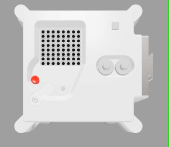

---
hide:
  - toc
---

## Envoyer un message

Ouvre [l'émulateur Sense HAT](https://trinket.io/mission-zero) pour le projet Mission Zero.

Tu vas constater que trois lignes de code ont été ajoutées automatiquement :

    from sense_hat import SenseHat
    sense = SenseHat()
    sense.set_rotation(270)

Ajoute cette ligne tout en haut, avant la première ligne

    from time import sleep

Tu en auras besoin pour mettre ton programme en pause à certains moment.


Ce code se connecte à l'Astro Pi et s'assure que l'écran LED de l'Astro Pi est affiché dans le bon sens. Laisse ce code ici car tu en auras besoin.

Peut-être pourrais-tu laisser un message de bienvenue aux astronautes de l'ISS qui travaillent près de l'Astro Pi ? Faisons défiler un message sur l'écran.

Ajoute cette ligne en-dessous de l'autre ligne de code :

    sense.show_message("Astro Pi")

Appuie sur le bouton **Run** (Exécuter) et regarde le message `Astro Pi` défiler sur l'écran LED.



Pour afficher un message différent, tu peux écrire ce que tu veux entre les guillemets (`""`).

### Quels caractères peuvent être utilisés ?

Le Sense HAT ne peut afficher que le jeu de caractères Latin 1, ce qui signifie que seuls les caractères suivants sont disponibles. Les autres caractères s'afficheront sous la forme d'un `?` .

```
+-*/!"#$><0123456789.=)(

ABCDEFGHIJKLMNOPQRSTUVWXYZ

abcdefghijklmnopqrstuvwxyz

?,;:|@%[&_']\~
```

Tu peux aussi modifier la vitesse de défilement du message sur l'écran. Ajoute un `scroll_speed` (vitesse de défilement) à ta ligne de code, comme ceci :

```python
sense.show_message("Astro Pi", scroll_speed=0.05)
```

La vitesse par défaut du message est `0.1`. En réduisant le nombre, tu fais défiler le message plus rapidement et en augmentant le nombre tu fais défiler le message plus lentement.
