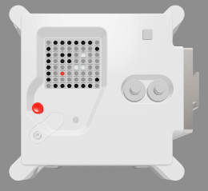

---
hide:
  - toc
---

## Afficher une image

Tu peux afficher des images sur la matrice LED de l'Astro Pi. Ton message de bienvenue pour les astronautes pourrait peut-être inclure une image ou un motif avec le texte, ou à la place du texte ?

En bas de ton programme, crée des variables pour les couleurs que tu veux définir pour dessiner une image. Tu peux utiliser autant de couleurs que tu veux mais dans cet exemple, nous nous limiterons à quelques couleurs - blanc (`w`), noir (`b`), et deux nuances de gris (`g` et `s`). Remarque que les nuances sont obtenues en réduisant la quantité de lumière dans les trois canaux tout en gardant les mêmes quantités.

    w = (255, 255, 255)
    b = (0, 0, 0)
    g = (0,255,0)
    s = (200,255,200)
    r = (255,0,0)

**Remarque :** Cette fois-ci, il est conseillé de donner aux variables définies pour les couleurs des noms se limitant à une lettre, car cela permettra de gagner du temps à l'étape suivante, quand tu les saisiras de nombreuses fois. De plus, en utilisant des noms à une seule lettre tu pourras voir plus facilement l'image que tu vas dessiner.

Sous tes nouvelles variables, crée une liste de 64 éléments. Chaque élément représente un pixel de la matrice du LED et correspond à l'une des variables de couleur que tu as définies. Dessine ton image en mettant une variable à l'endroit où tu veux que la couleur de cette variable apparaisse. Nous avons dessiné un Astro Pi en utilisant les pixels noirs (`b`) pour l'arrière-plan et les pixels gris (`g`) pour dessiner les parties métalliques du boitier de l'Astro Pi :

    image = [
        b, r, b, b, b, b, r, b,
        b, b, g, r, r, g, b, b,
        b, r, g, g, g, g, r, b,
        b, r, g, b, b, g, r, b,
        b, r, w, g, g, w, r, b,
        b, r, g, w, w, g, r, b,
        b, b, g, r, r, g, b, b,
        b, g, g, b, b, g, g, b,
    ]

Ajoute une ligne de code pour afficher ton image sur l'écran LED.

    sense.set_pixels(image)

Appuie sur **Run** (Exécuter) pour afficher ton image.

Ensuite, sur la ligne qui suit celle qui affiche ton image, ajoute ce code pour créer un temps d'attente de deux secondes :

    sleep(2)

Crée ta propre image ou ton propre motif que tu veux afficher pour les astronautes !
