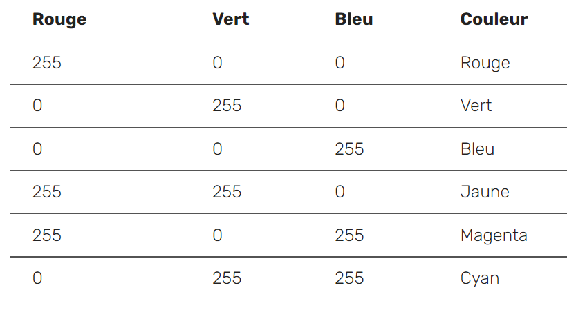
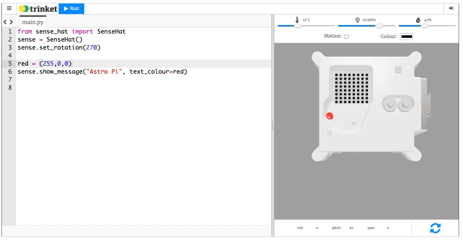

## Ajouter de la couleur

Les LED de l'Astro Pi peuvent également afficher des couleurs. Tu peux spécifier une couleur en créant une variable et en lui attribuant une valeur de couleur RGB.

### Représenter des couleurs avec des nombres

La couleur d’un objet dépend de la couleur de la lumière qu’il réfléchit ou émet. La lumière peut avoir différentes longueurs d’onde et la couleur de la lumière dépend de la longueur d’onde. La couleur de la lumière en fonction de sa longueur d’onde peut être vue dans le diagramme ci-dessous. Tu pourrais reconnaître cela comme les couleurs de l’arc-en-ciel.

Les humains voient la couleur grâce à des cellules spéciales dans nos yeux. Ces cellules sont appelées cônes. Nous avons trois types de cellules de cône et chaque type détecte soit une lumière rouge, bleue ou verte. Par conséquent, toutes les couleurs que nous voyons ne sont que des mélanges de couleurs rouge, bleu et vert.

Dans le mélange de couleurs additif, trois couleurs (rouge, vert et bleu) sont utilisées pour créer d’autres couleurs. Dans l’image ci-dessus, il y a trois spots de même luminosité, un pour chaque couleur. En l’absence de toute couleur, le résultat est noir. Si les trois couleurs sont mélangées, le résultat est blanc. Lorsque rouge et vert se combinent, le résultat est jaune. Lorsque rouge et bleu se combinent, le résultat est magenta. Lorsque bleu et vert se combinent, le résultat est cyan. Il est possible de faire encore plus de couleurs en faisant varier la luminosité des trois couleurs originales utilisées.

Les ordinateurs stockent tout en tant que 1 et 0. Ces 1 et 0 sont souvent organisés en ensembles de 8, appelés octets.

Un seul octet peut représenter n’importe quel nombre de 0 à 255.

Lorsque nous voulons représenter une couleur dans un programme informatique, nous pouvons le faire en définissant les quantités de rouge, de bleu et de vert qui composent cette couleur. Ces quantités sont généralement stockés sous forme d’ un seul octet et donc comme un nombre compris entre 0 et 255.

Voici un tableau montrant certaines valeurs de couleur:

Crée une variable qui servira à stocker la couleur que tu as choisi. Par exemple, si tu as choisi la couleur rouge, tu vas écrire cette ligne de code :

    red = (255,0,0)

Tu peux maintenant afficher ton texte dans la couleur de ton choix ! Pour indiquer au programme d'utiliser la couleur que tu as créée, ajoute le paramètre `text_colour` (couleur du texte) à la ligne de code qui affiche ton texte :

    red = (255,0,0)
    sense.show_message("Astro Pi", text_colour=red)

Tu peux également modifier la couleur d'arrière-plan de l'écran. Choisis une autre couleur et crée une autre variable pour cette couleur. Pour indiquer au programme d'utiliser la couleur d'arrière-plan que tu as choisie, ajoute le paramètre `back_colour` (couleur de l'arrière-plan) à ton code :

    red = (255,0,0)
    green = (0,255,0)
    sense.show_message("Astro Pi", text_colour=red, back_colour=green)

Modifie le texte et la couleur du message de bienvenue - quel message veux-tu envoyer aux astronautes à bord de l'ISS ?

